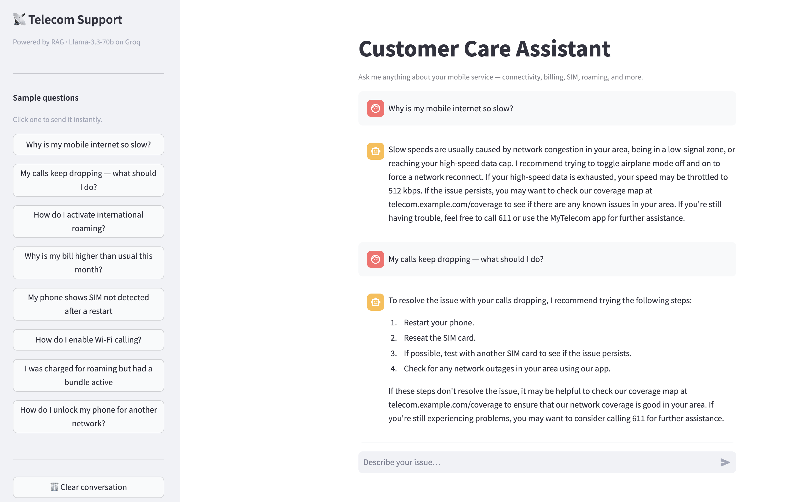

# Agentic AI Shopping Assistant & Telecom RAG Chatbot

An AI-powered application built with LangChain that demonstrates autonomous agents, Retrieval-Augmented Generation (RAG), vector databases, and modern LLM integration.

This project contains two AI applications:

- 🛍️ Shopping Recommendation Agent
- 💬 Telecom RAG Customer Support Chatbot

---

## Features

### Shopping Agent

- Product recommendation using LLM reasoning
- Tool-calling agent built with LangChain
- SQLite product database
- Image-aware product recommendations
- Review retrieval

### Telecom RAG Chatbot

- PDF knowledge base
- FAQ retrieval
- ChromaDB vector search
- Sentence Transformer embeddings
- LangChain RetrievalQA pipeline
- Natural language customer support

---

## Screenshots

### Shopping Agent


### Product Recommendation


### Telecom RAG Chatbot



---

## Tech Stack

- Python
- LangChain
- Streamlit
- ChromaDB
- SQLite
- HuggingFace Sentence Transformers
- Gemini
- Groq
- Llama Vision
- Qwen
- Pandas

---

## Project Structure

```
project_shopping_agent/
project_telecom/
rag_basics/
simple_llm_calls/
single_agent/
vector_db/
```

---

## Installation

Clone the repository

```bash
git clone https://github.com/vihaank1/AgenticAI.git
cd AgenticAI
```

Install dependencies

```bash
pip install -r requirements.txt
```

Configure your API keys

```
GEMINI_API_KEY=...
GROQ_API_KEY=...
```

Run

```bash
streamlit run project_telecom/app.py
```

or

```bash
streamlit run project_shopping_agent/app.py
```

---

## Learning Objectives

This project explores:

- Retrieval-Augmented Generation (RAG)
- AI Agents
- Vector Databases
- Prompt Engineering
- Tool Calling
- LLM Integration
- Embedding Models

---

## Future Improvements

- Conversation memory
- Multi-document upload
- Streaming responses
- Source citations
- Multiple LLM selection
- Enhanced UI
- Cloud deployment

---

## Acknowledgements

This project was inspired by the Codebasics Agentic AI Crash Course.

The repository has been adapted for educational purposes. Proprietary course datasets and materials are not redistributed through this repository. Please obtain the original learning resources directly from Codebasics if needed.

---

## License

This repository contains my implementation and project structure. Please respect the licensing and terms of use for any third-party libraries or external learning materials referenced by this project.
